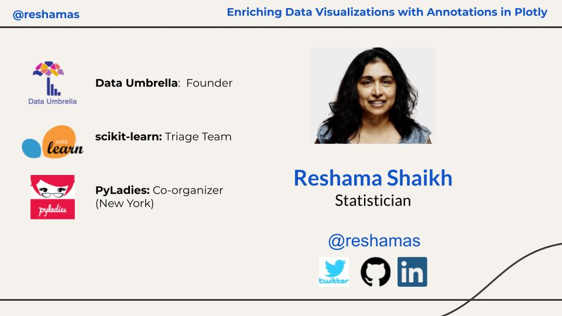

# PyOhio: Annotating Plotly Visualizations (by Reshama Shaikh)

https://user-images.githubusercontent.com/2507232/126041752-4182bfb9-e5ea-4f5d-b8d3-221dd0d03af0.mp4

### Speaker
Reshama Shaikh [(@reshamas)](https://twitter.com/reshamas)

### Conference
- [PyOhio](https://www.pyohio.org/2021/)
- July 31, 2021 (Saturday)

### Talk
Enriching Data Visualizations with Annotations in Plotly

### Session Type
Thunder talk:  10 minutes

### Talk Description
[Plotly](https://plotly.com/python/) is a versatile python graphing library which lets us make interactive graphs.  In this talk, I will show how to go from a typical static visualization to one enriched with annotations which will convey to your audience a more complete interpretation of your visualization. 

Here are some sample [plotly visualizations](https://reshamas.github.io/covid19-plots/) I have made, and in this talk, I will share how to create them.

### Talk objective  
Getting started annotating graphs.

### Link to GitHub Repo
https://github.com/reshamas/pyohio-plotly

### Link to Video Demo
https://twitter.com/reshamas/status/1406792972226682881
